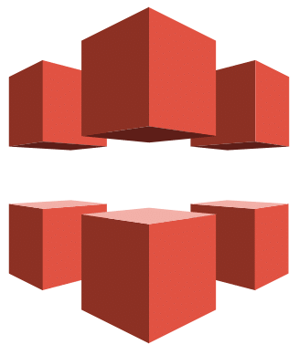

  
  

<h1 align="center">Hi 👋, I'm kimseungdeok</h1>
<h3 align="center">A passionate frontend developer from 🇰🇷</h3>

### 🙋‍♂️ About Me

- 👨‍💻 I’m currently learning React Native
- 📫 Reach me: tmdejr1117@gmail.com
- 📝 Blog : https://velog.io/@tmdejr1117

### 🛠️ Skills

#### Front-End

  
  
  
  
    
  
  
  
  

#### Back-End

  
  

#### DevOps

  
  
  

#### Collaboration & Design & Document

#### Others

 
  

### 🏆 Badges

